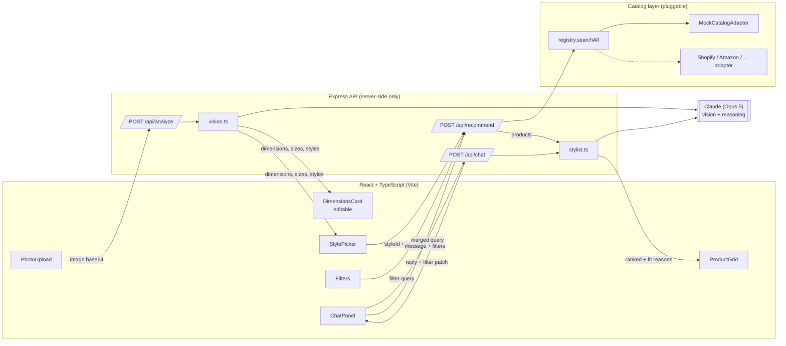

# StyleFit — Architecture

## 1. Overview

StyleFit is a photo-to-fit personal shopping app. A user uploads a photo; a vision
model estimates their build, body measurements, and clothing sizes, and suggests
styles that suit them. The user picks a style and receives ranked, explained
clothing suggestions they can filter (price, ship time, category) and refine in
natural language via chat.

The app is **e-commerce-agnostic**: the product source sits behind a single
`CatalogAdapter` interface, so any store (Amazon, Shopify, a marketplace API, a CSV)
can power results without changing the UI or the styling logic. A mock adapter ships
so the full flow runs with zero integrations.

## 2. Tech stack

| Layer | Choice | Notes |
|---|---|---|
| Frontend | React 19 + TypeScript, Vite 7 | SPA, dev server on `:5173` |
| Backend | Express 5 (TypeScript, run via `tsx`) | API on `:8787`, proxied from Vite |
| AI | Anthropic Claude (`claude-opus-5`) | Vision + reasoning; server-side only |
| Catalog | Pluggable `CatalogAdapter` | Mock adapter included |

The Anthropic API key and all catalog adapters live **only on the server**. The
browser talks exclusively to `/api/*`, which Vite proxies to Express in dev.

## 3. System diagram



## 4. End-to-end flow

1. **Analyze** — the browser reads the chosen image as base64 and POSTs it to
   `/api/analyze`. `vision.ts` sends the image to Claude vision and gets back a
   structured `AnalysisResult`: build description, measurement ranges (cm),
   recommended sizes, complementary colors, a self-reported confidence score, and
   3–5 style suggestions. Measurements render in an **editable** card because a
   single uncalibrated photo only yields estimates.
2. **Recommend** — a chosen `styleId` plus the active filter `CatalogQuery` hit
   `/api/recommend`. The catalog `registry` fans the normalized query out to every
   registered adapter (`searchAll`) and merges results. Claude (`stylist.ts`) then
   ranks the returned products for this specific person and writes a one-line fit
   reason per item. It only reorders and explains real catalog items — it never
   invents products, and any items the model omits are appended so nothing silently
   disappears.
3. **Refine** — `/api/chat` accepts the conversation plus the current filters.
   Claude interprets natural language ("cheaper", "ships this week", "more green",
   "under $80") into a structured `queryUpdates` patch **and** a short reply. The
   frontend merges the patch into the query (a `null` value clears a field), which
   re-triggers a recommend.

## 5. Component responsibilities

### Backend (`server/`)

| File | Responsibility |
|---|---|
| `index.ts` | Express app, JSON body limit (15 MB for photos), routes, async error wrapper |
| `claude.ts` | Shared Anthropic client, `MODEL` constant, `textOf()`, tolerant `parseJson()` |
| `vision.ts` | `analyzePhoto()` — image → `AnalysisResult`; handles `refusal` stop reason |
| `stylist.ts` | `rankProducts()` and `chat()` — ranking + NL→filter translation |
| `catalog/adapter.ts` | The `CatalogAdapter` interface (the one e-commerce seam) |
| `catalog/mockAdapter.ts` | Reference adapter over an in-memory catalog; honors every query field |
| `catalog/mockData.ts` | 12-item demo catalog |
| `catalog/registry.ts` | Adapter list + `searchAll()` (fan-out, per-adapter failure isolation) |

### Frontend (`src/`)

| File | Responsibility |
|---|---|
| `App.tsx` | State + orchestration; recommend effect keyed to style/filters (not keystrokes) |
| `api.ts` | Typed `fetch` wrappers + `mergeQuery()` patch merge |
| `components/PhotoUpload.tsx` | Drag/drop or pick, base64 read, preview |
| `components/DimensionsCard.tsx` | Editable measurements, sizes, confidence, caveats |
| `components/StylePicker.tsx` | Style suggestion tiles |
| `components/Filters.tsx` | Category / price / ship-time / sort controls |
| `components/ProductGrid.tsx` | Ranked products with fit reasons |
| `components/ChatPanel.tsx` | Refinement chat with quick-suggestion chips |

### Shared (`shared/types.ts`)

The single source of truth for the client/server contract: `Measurements`,
`RecommendedSizes`, `StyleSuggestion`, `AnalysisResult`, `Product`, `CatalogQuery`,
`Recommendation`, and all API request/response payloads.

## 6. The e-commerce-agnostic seam

`server/catalog/adapter.ts`:

```ts
interface CatalogAdapter {
  readonly id: string;
  readonly name: string;
  search(query: CatalogQuery): Promise<Product[]>;
}
```

Everything upstream (UI, stylist ranking) speaks only the normalized `Product` and
`CatalogQuery` types. To add a real store:

1. Implement `CatalogAdapter` for that backend.
2. Normalize its responses into `Product`.
3. Add an instance to the `adapters` array in `server/catalog/registry.ts`.

`searchAll()` queries all adapters with `Promise.allSettled`, so one failing adapter
never sinks the others.

## 7. API reference

| Method / path | Request | Response |
|---|---|---|
| `GET /api/health` | — | `{ ok, adapters: [{id, name}] }` |
| `POST /api/analyze` | `{ imageBase64, mediaType }` | `AnalysisResult` |
| `POST /api/recommend` | `{ analysis, styleId, query }` | `{ recommendations, sources }` |
| `POST /api/chat` | `{ messages, currentQuery, analysis? }` | `{ reply, queryUpdates? }` |

## 8. Configuration

Environment (`.env`, server-side only):

| Var | Default | Purpose |
|---|---|---|
| `ANTHROPIC_API_KEY` | — | Anthropic credential (or use an `ant auth login` profile) |
| `STYLEFIT_MODEL` | `claude-opus-5` | Model override |
| `API_PORT` | `8787` | Express port (Vite proxy targets it) |

## 9. Build & verification status

Verified locally:

- `npm run typecheck` — clean.
- `npm run build` — frontend bundles (36 modules, ~64 KB gzip JS).
- API server boots; `/api/health` returns the mock adapter; request validation works.

Not exercised (require Anthropic credentials and incur cost): the three
Claude-backed endpoints `analyze`, `recommend`, `chat`.

## 10. Known limits & production considerations

- **Sizing accuracy** — absolute body measurements from one uncalibrated photo are
  inherently rough. Surfaced with a confidence score and made fully editable. For
  production, add guided capture, a reference object, or a user confirm/enter step.
- **Privacy** — photos are sent to the vision model per request and not stored, but
  a production build needs an explicit consent flow and a data-retention policy.
- **Cost/latency** — each analyze/recommend/chat call is a model request. Consider
  caching, cheaper models for ranking, and batching.
- **Catalog scale** — the mock adapter filters in memory. Real adapters should push
  filters to the backend and paginate; ranking should cap the candidate set sent to
  the model.
- **Auth/accounts, persistence, and rate limiting** are out of scope for the
  prototype.
```
