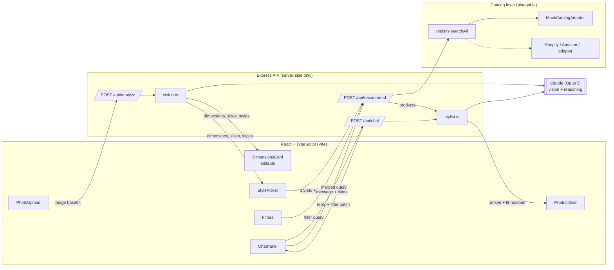

# StyleFit

[](https://github.com/kal-subram/style-fit/actions/workflows/ci.yml)

Upload a photo → get an estimated fit → pick a style → shop ranked, explained
clothing suggestions you can filter and refine by chat. The catalog is behind a
pluggable adapter, so **any e-commerce backend** (Amazon, Shopify, a marketplace
API, a CSV) can power the results without touching the rest of the app.

## Architecture



**Flow**
1. **Analyze** — the browser sends the photo to `/api/analyze`; `vision.ts` asks
   Claude (vision) for build, measurement ranges, recommended sizes, complementary
   colors, and 3–5 style suggestions. Measurements are editable in the UI because a
   single uncalibrated photo only yields estimates.
2. **Recommend** — a chosen style + the active filter query hit `/api/recommend`.
   The catalog `registry` fans the normalized query out to every adapter; Claude
   then ranks the returned products for this person and writes a one-line fit
   reason for each.
3. **Refine** — `/api/chat` turns natural language ("cheaper", "ships this week",
   "more green") into a structured filter patch plus a reply. The patch merges into
   the query and re-triggers a recommend.

The Anthropic API key and all catalog adapters live **only on the server**.

## Making it e-commerce-agnostic

`server/catalog/adapter.ts` defines the one seam:

```ts
interface CatalogAdapter {
  readonly id: string;
  readonly name: string;
  search(query: CatalogQuery): Promise<Product[]>;
}
```

To add a real store: implement `CatalogAdapter`, normalize the store's results into
`Product`, and add an instance to the list in `server/catalog/registry.ts`. Nothing
else changes — the UI and the stylist only ever see normalized `Product`s.

## Run it

```bash
npm install
cp .env.example .env      # add ANTHROPIC_API_KEY, or use `ant auth login`
npm run dev               # web on :5173, API on :8787 (proxied)
```

Open http://localhost:5173.

### Demo mode (no API key)

If no Anthropic credential is present, the server automatically runs in **demo
mode**: `/api/analyze`, `/api/recommend`, and `/api/chat` return canned, offline
responses so the entire app is usable for demos with zero setup. The catalog,
filters, sorting, and chat-driven filtering all work for real; only the AI outputs
are stubbed (analysis is a fixed sample, chat uses rule-based keyword parsing). A
banner in the UI shows when demo mode is active.

Force it explicitly (even with a key present):

```bash
STYLEFIT_MOCK=1 npm run dev
```

Provide `ANTHROPIC_API_KEY` (or run `ant auth login`) to switch to live Claude.
Tip: set `STYLEFIT_MODEL=claude-haiku-4-5` to keep live-mode cost minimal while testing.

## Layout

| Path | What |
|---|---|
| `shared/types.ts` | Types shared by client + server (the contract) |
| `server/vision.ts` | Photo → dimensions/sizes/styles (Claude vision) |
| `server/stylist.ts` | Rank products + chat-to-filters (Claude) |
| `server/catalog/` | Adapter interface, mock adapter, registry |
| `src/` | React UI (upload, dimensions, style, filters, grid, chat) |

## Notes & limits (prototype)

- **Sizing accuracy**: measurements from one photo are approximate — surfaced with a
  confidence score and fully editable. For production, add a reference-object or
  guided-capture step, or let users confirm/enter measurements.
- **Privacy**: photos are sent to the vision model per request and not stored, but a
  production build needs an explicit consent + retention policy.
- Model defaults to `claude-opus-5`; override with `STYLEFIT_MODEL`.
